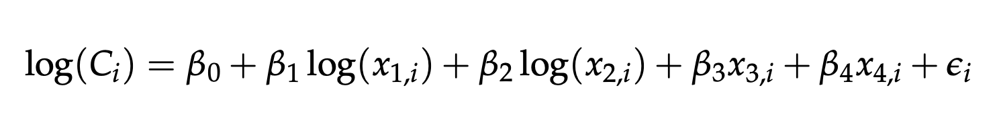
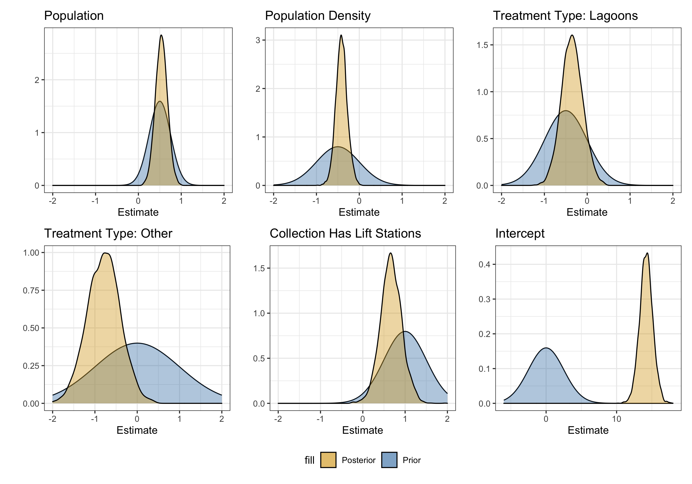

# About the Model

The model that we use for this prediction is a Bayesian linear model. We used standard econometric techniques along with specification of prior distributions in order estimate the cost of a wastewater treatment plant. Below is the log form of the model we specified, where the first two explanatory variables are population and population density, while the explanatory variables that are not logged are the categorical variables: "treatment type" and "has pumps."

We also used Bayesian techniques for more easily interpretable outputs of this model. While this model's prediction power is not particularly strong, we have very good estimates of the distributions of the parameters in these models. These insights allow for an understanding of how certain variables effect the total cost of your wastewater treatment plant. Below is a plot with the prior distributions used in this model that have now been updated to posterior distributions given the data we have. 

As you can see, we now have our posterior distributions in gold which represents our estimate and uncertainty of variables in the model. When interpreting these distributions, remember that they are with respect to the log of total cost rather than just the total cost, and that the estimates for population and population density are logged as well. These figures should help you understand the effect of certain variables on the total cost of your wastewater treatment plant, holding all of the other factors constant. 

For an example of interpreting this model, we can consider the variable population density. We see that the gold posterior distribution is almost entirely in the negative, so we believe that the effect of population density holding all other variables constant is negative. This means that you would expect your wastewater treatment plant to cost less if you have all the same variables (population, pumps/no pumps, same type of plant) except you have a higher population density. This makes sense, as the collection would likely cost less with a higher population density. We can also interpret the spread of this gold distribution as how confident we are about the value of this estimate. In this case, we are relatively confident in the value of this parameter.