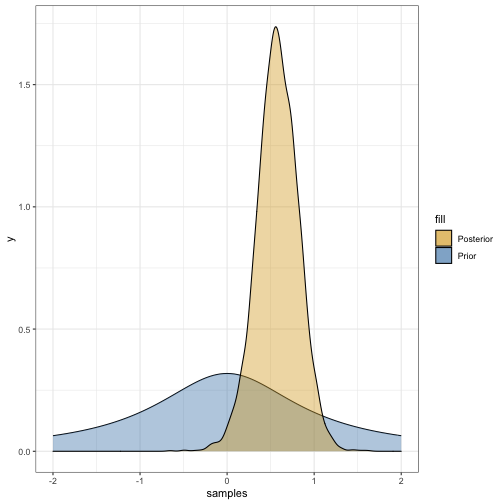

```r
# Load data
dat <- read_csv("final_cost_small.csv")

dat <- dat %>%
    mutate(
    has_pumps = case_when(
      Collection %in% c("Conventional Gravity, Effluent Pumps",
                        "Effluent Pumps", "Effluent Pumps, Conventional Gravity",
                        "Conventional Gravity, Effluent Pumps, Small Diameter Gravity") ~ TRUE,
      Collection %in% c("Conventional Gravity", "-") ~ FALSE
    )
    ) %>%
  select(-X1, -X1_1) %>%
  mutate(
    pop_density = Population / sq_mi
  )
```


```r
# lm
m1 <- lm(log(`Total Cost`) ~ dryDesignFlowMGD + log(Population) + basic_treatment + Region + pop_density, data = dat)
summary(m1)
```

```
## 
## Call:
## lm(formula = log(`Total Cost`) ~ dryDesignFlowMGD + log(Population) + 
##     basic_treatment + Region + pop_density, data = dat)
## 
## Residuals:
##     Min      1Q  Median      3Q     Max 
## -1.0161 -0.3193 -0.0522  0.4327  1.0318 
## 
## Coefficients:
##                          Estimate Std. Error t value Pr(>|t|)    
## (Intercept)            11.7254480  1.4380955   8.153 1.26e-07 ***
## dryDesignFlowMGD       -0.2998841  0.4170272  -0.719   0.4808    
## log(Population)         0.5947076  0.2288710   2.598   0.0176 *  
## basic_treatmentLagoons -0.0283868  0.3238741  -0.088   0.9311    
## basic_treatmentOther    0.2679101  0.4977851   0.538   0.5967    
## RegionNWR               0.4359748  0.4216625   1.034   0.3141    
## RegionWR                0.6508638  0.3020306   2.155   0.0442 *  
## pop_density            -0.0005429  0.0001962  -2.767   0.0123 *  
## ---
## Signif. codes:  0 '***' 0.001 '**' 0.01 '*' 0.05 '.' 0.1 ' ' 1
## 
## Residual standard error: 0.6207 on 19 degrees of freedom
##   (7 observations deleted due to missingness)
## Multiple R-squared:  0.5329,	Adjusted R-squared:  0.3607 
## F-statistic: 3.096 on 7 and 19 DF,  p-value: 0.02354
```

```r
m2 <- lm(`Total Cost` ~ `Construction Cost`, data = dat)
summary(m2)$r.squared
```

```
## [1] 0.9875133
```

```r
m3 <- lm(log(`Total Cost`) ~ dryDesignFlowMGD + Region + pop_density, data = dat)
summary(m3)
```

```
## 
## Call:
## lm(formula = log(`Total Cost`) ~ dryDesignFlowMGD + Region + 
##     pop_density, data = dat)
## 
## Residuals:
##      Min       1Q   Median       3Q      Max 
## -1.07174 -0.34326 -0.00713  0.47668  1.23106 
## 
## Coefficients:
##                    Estimate Std. Error t value Pr(>|t|)    
## (Intercept)      15.4780753  0.3000347  51.588   <2e-16 ***
## dryDesignFlowMGD  0.4504491  0.2941216   1.532   0.1399    
## RegionNWR         0.2414455  0.3986272   0.606   0.5509    
## RegionWR          0.7957087  0.2945342   2.702   0.0130 *  
## pop_density      -0.0003968  0.0001936  -2.049   0.0525 .  
## ---
## Signif. codes:  0 '***' 0.001 '**' 0.01 '*' 0.05 '.' 0.1 ' ' 1
## 
## Residual standard error: 0.6813 on 22 degrees of freedom
##   (7 observations deleted due to missingness)
## Multiple R-squared:  0.3483,	Adjusted R-squared:  0.2298 
## F-statistic:  2.94 on 4 and 22 DF,  p-value: 0.04349
```

```r
m4 <- lm(log(`Total Cost`) ~ log(Population) + Region + pop_density, data = dat)
summary(m4)
```

```
## 
## Call:
## lm(formula = log(`Total Cost`) ~ log(Population) + Region + pop_density, 
##     data = dat)
## 
## Residuals:
##      Min       1Q   Median       3Q      Max 
## -1.37493 -0.34481  0.04308  0.43029  0.92105 
## 
## Coefficients:
##                   Estimate Std. Error t value Pr(>|t|)    
## (Intercept)     11.1967601  1.0016808  11.178 5.35e-11 ***
## log(Population)  0.6373928  0.1518303   4.198 0.000319 ***
## RegionNWR        0.6721314  0.3700692   1.816 0.081848 .  
## RegionWR         0.7471939  0.2781108   2.687 0.012894 *  
## pop_density     -0.0005672  0.0001972  -2.876 0.008317 ** 
## ---
## Signif. codes:  0 '***' 0.001 '**' 0.01 '*' 0.05 '.' 0.1 ' ' 1
## 
## Residual standard error: 0.6524 on 24 degrees of freedom
##   (5 observations deleted due to missingness)
## Multiple R-squared:  0.5549,	Adjusted R-squared:  0.4808 
## F-statistic: 7.482 on 4 and 24 DF,  p-value: 0.0004625
```


```r
# Bayesian Modeling with {tidymodels} and {rstan}

## Set seed
set.seed(3737)

## Specify priors
prior_dist <- rstanarm::student_t(df = 1, location = 0)

## Create model
bayes_mod <-
  linear_reg() %>% 
  set_engine("stan", 
             prior_intercept = prior_dist, 
             prior = prior_dist) %>%
  translate()

## Fit model to data
bayes_fit <-
  bayes_mod %>%
  fit(log(`Total Cost`) ~ log(Population) + basic_treatment + dryDesignFlowMGD + pop_density + Region,
      data = dat)

## Extract fit results
# bayes_fit$fit
# bayes_fit$fit$coefficients
stan_fit <- bayes_fit$fit$stanfit
# class(stan_fit)
# stan_fit
# stan_fit@sim$samples[[4]]$`beta[4]`
bayes_fit
```

```
## parsnip model object
## 
## Fit time:  46.2s 
## stan_glm
##  family:       gaussian [identity]
##  formula:      log(`Total Cost`) ~ log(Population) + basic_treatment + dryDesignFlowMGD + 
## 	   pop_density + Region
##  observations: 27
##  predictors:   8
## ------
##                        Median MAD_SD
## (Intercept)            11.8    1.5  
## log(Population)         0.6    0.2  
## basic_treatmentLagoons  0.0    0.3  
## basic_treatmentOther    0.3    0.5  
## dryDesignFlowMGD       -0.3    0.4  
## pop_density             0.0    0.0  
## RegionNWR               0.4    0.4  
## RegionWR                0.6    0.3  
## 
## Auxiliary parameter(s):
##       Median MAD_SD
## sigma 0.6    0.1   
## 
## ------
## * For help interpreting the printed output see ?print.stanreg
## * For info on the priors used see ?prior_summary.stanreg
```

```r
## Visualize dist for log(pop)
log_pop_dist_df <- data.frame(samples = c(stan_fit@sim$samples[[1]]$`beta[1]`,
                                          stan_fit@sim$samples[[2]]$`beta[1]`,
                                          stan_fit@sim$samples[[3]]$`beta[1]`,
                                          stan_fit@sim$samples[[4]]$`beta[1]`))
ggplot(log_pop_dist_df,
       aes(samples)) +
  stat_function(fun = dt, args = list(df = 1)) +
  stat_function(fun = dt, args = list(df = 1), geom = "area", aes(fill = "Prior"), alpha = 0.4) +
  scale_fill_manual(values = c("goldenrod", "steelblue")) +
  geom_density(aes(fill = "Posterior"), alpha = 0.4) +
  theme_bw() +
  xlim(-2,2)
```


