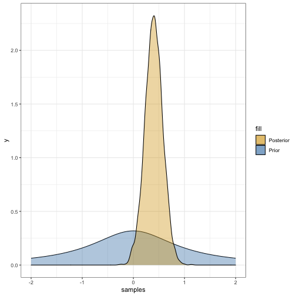

```r
# Make the model
## Set seed
set.seed(3737)

## Specify priors
prior_dist <- rstanarm::student_t(df = 1, location = 0, scale = 2)

## Split train/test
wwtp_split <- usda_cost %>%
  initial_split()

wwtp_train <- training(wwtp_split)
wwtp_test <- testing(wwtp_split)

## Create model
bayes_mod <-
  linear_reg() %>% 
  set_engine("stan", 
             prior_intercept = prior_dist, 
             prior = prior_dist) %>%
  translate()

## Train
bayes_fit <-
  bayes_mod %>%
  fit(log(`Total Cost`) ~ log(Population) + basic_treatment + has_pumps,
      data = wwtp_train)

# bayes_fit$fit
# bayes_fit$fit$coefficients
stan_fit <- bayes_fit$fit$stanfit
# class(stan_fit)
# stan_fit
# stan_fit@sim$samples[[4]]$`beta[4]`

bayes_fit
```

```
## parsnip model object
## 
## Fit time:  724ms 
## stan_glm
##  family:       gaussian [identity]
##  formula:      log(`Total Cost`) ~ log(Population) + basic_treatment + has_pumps
##  observations: 25
##  predictors:   5
## ------
##                        Median MAD_SD
## (Intercept)            12.4    1.2  
## log(Population)         0.4    0.2  
## basic_treatmentLagoons -0.6    0.3  
## basic_treatmentOther   -0.2    0.6  
## has_pumpsTRUE           0.8    0.4  
## 
## Auxiliary parameter(s):
##       Median MAD_SD
## sigma 0.8    0.1   
## 
## ------
## * For help interpreting the printed output see ?print.stanreg
## * For info on the priors used see ?prior_summary.stanreg
```

```r
## Visualize dist for log(pop)
log_pop_dist_df <- data.frame(samples = c(stan_fit@sim$samples[[1]]$`beta[1]`,
                                          stan_fit@sim$samples[[2]]$`beta[1]`,
                                          stan_fit@sim$samples[[3]]$`beta[1]`,
                                          stan_fit@sim$samples[[4]]$`beta[1]`))
ggplot(log_pop_dist_df,
       aes(samples)) +
  stat_function(fun = dt, args = list(df = 1)) +
  stat_function(fun = dt, args = list(df = 1), geom = "area", aes(fill = "Prior"), alpha = 0.4) +
  scale_fill_manual(values = c("goldenrod", "steelblue")) +
  geom_density(aes(fill = "Posterior"), alpha = 0.4) +
  theme_bw() +
  xlim(-2,2)
```




```r
# Frequentist
## create model
freq_mod <- linear_reg() %>%
  set_engine("lm")

## train
freq_fit <- 
  freq_mod %>%
  fit(log(`Total Cost`) ~ log(Population) + basic_treatment + has_pumps,
      data = wwtp_train)
freq_fit
```

```
## parsnip model object
## 
## Fit time:  28ms 
## 
## Call:
## stats::lm(formula = log(`Total Cost`) ~ log(Population) + basic_treatment + 
##     has_pumps, data = data)
## 
## Coefficients:
##            (Intercept)         log(Population)  basic_treatmentLagoons    basic_treatmentOther           has_pumpsTRUE  
##                12.4151                  0.3962                 -0.6445                 -0.2362                  0.8589
```

```r
freq_fit$fit$coefficients
```

```
##            (Intercept)        log(Population) basic_treatmentLagoons   basic_treatmentOther          has_pumpsTRUE 
##             12.4150802              0.3962317             -0.6444736             -0.2362173              0.8589306
```

```r
tidy(freq_fit)
```

```
## # A tibble: 5 x 5
##   term                   estimate std.error statistic       p.value
##   <chr>                     <dbl>     <dbl>     <dbl>         <dbl>
## 1 (Intercept)              12.4       1.16     10.7   0.00000000105
## 2 log(Population)           0.396     0.167     2.38  0.0276       
## 3 basic_treatmentLagoons   -0.644     0.348    -1.85  0.0786       
## 4 basic_treatmentOther     -0.236     0.628    -0.376 0.711        
## 5 has_pumpsTRUE             0.859     0.357     2.40  0.0260
```


